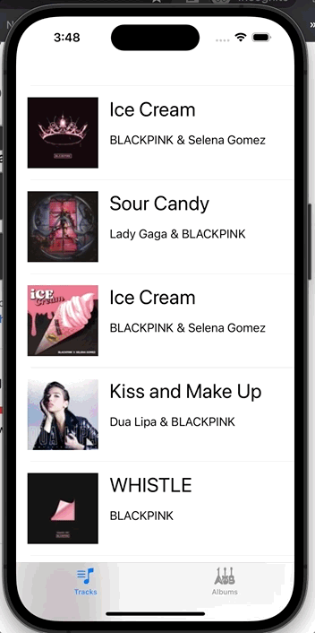

# Tunely 2
 Tunely (Part 2) - CodePath iOS 102
 
  

### Required Features
- [x] View real track data fetched from the iTunes API
- [x] Use a UITabBarController to allow for a different way to view tracks
- [x] View the album covers using a UICollectionView
